# Intelligence Report Handoff

Self-contained handoff for the next agent. Contracts and data shapes live in the architecture and design-token specs — do not duplicate them here.

---

## Mission & deadline

**Deliverable:** Digital Intelligence Annual Report — Banking Sector 2026  
**Public drop:** 2026-10-05  
**Measurement window:** 2025-10-01 → 2026-09-30 (`America/Nassau`)  
**Imprint path:** `ingestion/intelligence/` + `data/intelligence/` (JSON-on-disk only for Issue 01)  
**Cohort:** six banks in `ingestion/intelligence/cohort.yaml` (handles verified May 2026, commit `197f1c7`)

---

## Read these first

1. [intel/bod-intelligence-architecture.md](bod-intelligence-architecture.md) — build plan, module contracts, registry, methodology gates, §8 build order  
2. [intel/bod-intelligence-design-tokens.md](bod-intelligence-design-tokens.md) — `/intelligence` visual tokens (deferred until data shape locks)  
3. [ingestion/intelligence/cohort.yaml](../ingestion/intelligence/cohort.yaml) — source of truth for banks, handles, `series_token`, methodology rules  
4. [ingestion/intelligence/methodology.md](../ingestion/intelligence/methodology.md) — grounded capture transparency notes  
5. [REPO_AUDIT.md](../REPO_AUDIT.md) — import style, path constants, logging, embedding reuse conventions  

---

## Out of scope / already shipped (do not reopen)

Site budget work is live on `main`. Do **not** redo unless asked:

- Maintenance off; FY 2026/27 current; FY 2025/26 also published locally  
- Fiscal-year switcher fixed (no silent API fallbacks) — commits `33c8ffd`, `da0a01e`  
- Local Docker Postgres on `5433`; publish via `backend/scripts/publish_document.py`  
- Production still needs its own re-publish of corrected 2026/27 + 2025/26 if prod DB is stale  

---

## Repo map

```
ingestion/intelligence/
  cohort.yaml, cohort.py, types.py, errors.py, logging_config.py
  run_capture.py, run_validate.py, methodology.md
  social/     wayback, facebook, instagram, youtube, tiktok, twitter, socialblade
  web/        similarweb, ahrefs_free, bing_serp, pagespeed, structured_data
  capture/    orchestrator.py, registry.py, delta_validator.py

data/intelligence/
  raw/  processed/  exports/  logs/capture.log  registry.json

tests/intelligence/
  test_*.py per module + fixtures/
```

Pydantic contracts (`Platform`, `SourceProvenance`, `SocialMetric`, `PostMetric`, `WebMetric`, `CaptureResult`) are in `types.py` — see architecture §3.

---

## Done vs not done (architecture §8)

| Step | Status |
|------|--------|
| 1 Scaffold | Done |
| 2 Cohort verification | Done (`197f1c7`) |
| 3 `types.py` + tests | Done |
| 4 `registry.py` + tests | Done |
| 5 `wayback.py` + fixtures | Done |
| 6 Orchestrator + `run_capture.py` | Done — all 12 keys in `SCRAPERS` |
| 7 Remaining scrapers | **Done** (youtube → structured_data; fixture tests under `tests/intelligence/`) |
| 8 `delta_validator.py` | **Done** (+ `run_validate.py`, tests) |
| 9 `methodology.md` | **Drafted** (grounded in Jul 2026 capture behaviour) |

**Runtime reality (2026-07-19)**

- Scrapers registered: `wayback`, `youtube`, `similarweb`, `instagram`, `facebook`, `tiktok`, `twitter`, `socialblade`, `ahrefs_free`, `pagespeed`, `structured_data` (`bing_serp` unregistered — API discontinued)
- Full cohort capture for `2026-08-15` finished `complete=6` (log: `data/intelligence/logs/full_cohort_2026-08-15.log`)
- Strong signals: Facebook likes-as-followers, YouTube API subs, PageSpeed on reachable hosts, Instagram followers where meta tags exist
- Cohort notes: Fidelity `domain: null` (no public marketing site); Bank of The Bahamas homepages via `www.`; Similarweb 403 **accepted Issue 01 gap**; Ahrefs often client-rendered nulls; Wayback backfill Oct 2025 – Jul 2026 completed (0 in-window snapshots; log `data/intelligence/logs/wayback_backfill_oct2025_jul2026.log`)
- Design tokens drafted; no `frontend/src/app/intelligence/` or `backend/app/api/intelligence.py` yet  

---

## How to run

From repo root (`run_capture.py` / `run_validate.py` insert repo root on `sys.path`):

```bash
backend/.venv/bin/python ingestion/intelligence/run_capture.py --date 2026-08-15
backend/.venv/bin/python ingestion/intelligence/run_capture.py \
  --date 2026-08-15 --bank commonwealth_bank \
  --scrapers ahrefs_free --scrapers pagespeed --scrapers structured_data

backend/.venv/bin/python ingestion/intelligence/run_validate.py \
  --trial data/intelligence/exports/example_trial.json --apply

backend/.venv/bin/python ingestion/intelligence/run_wayback_backfill.py --dry-run
./scripts/run_intelligence_weekly_capture.sh 2026-08-01

# Live snapshot (API + UI)
# GET /api/v1/intelligence/snapshot
# http://localhost:3000/intelligence

pytest tests/intelligence/ -q
```

`--bank` and `--scrapers` are **repeatable** (not comma-separated). Omit `--bank` for all cohort banks; omit `--scrapers` for every key in `SCRAPERS`.

Required secrets (see `.env.example` / `backend/.env`): `YOUTUBE_API_KEY`, `PAGESPEED_API_KEY` (falls back to YouTube key). Bing Search is discontinued for Issue 01 (`bing_serp` not in `SCRAPERS`).

---

## Next work (ordered)

```mermaid
flowchart LR
  scrapersDone["Scrapers_and_validator_done"] --> cohortCapture["Full_cohort_live_capture"]
  cohortCapture --> wayback["Wayback_backfill_Aug"]
  wayback --> weekly["Weekly_live_capture_Aug"]
  weekly --> validate["Delta_validation_Sep"]
  validate --> freeze["Lock_dataset_Sep28"]
  freeze --> surface["Frontend_backend_mid_Aug_Sep"]
  surface --> release["Public_drop_Oct5"]
```



1. **Live capture cadence** — from Aug 1 use `./scripts/run_intelligence_weekly_capture.sh` (cron example in script header); daily in the final two weeks before Sep 13. One merged run per date.  
2. **Polish `/intelligence` surface** — scaffold live at `GET /api/v1/intelligence/snapshot` + `frontend/src/app/intelligence/`; expand charts/PDF later against locked shapes.  
3. **Wayback follow-up (optional)** — backfill found zero in-window FB/IG snapshots; widen `CDX_WINDOW_DAYS` only with explicit methodology sign-off.  
4. **Delta validation (Sep 14–27)** — Rival IQ / SEMrush + `run_validate.py --apply`; flag >5% variance.  
5. **Freeze dataset Sep 28** → press pre-brief → **public drop Oct 5**.  

---

## Non-negotiable methodology gates

| Gate | Rule |
|------|------|
| Public only | No auth cookies, OAuth, or session storage |
| Rate limit | ≥2s between requests to the same host; backoff on 429/503 |
| User-Agent | `BahamasOpenDataBot/1.0 (+https://bahamasopendata.com/intelligence)` |
| robots.txt | Honour where present; disclose deviations in methodology.md |
| Provenance | Every metric: source URL, UTC `fetched_at`, HTTP status |
| No synthetic data | Failures → `None` / errors list — never infer or interpolate |
| No mock API | Future `/api/v1/intelligence/*` raises on missing data — never mock like `/ask` |

---

## Open decisions (unresolved)

1. **Naming:** `bod_intel_*` (public brand) vs `np_intel_*` (`national-pulse`) vs mixed — for v2 tables, logs, Pinecone `document_type`.  
2. **Series colours:** final lock of `--intel-series-1` … `--intel-series-6` to the six banks (provisional today via `cohort.yaml` `series_token`).  
3. **Bahamian number formatting:** BSD currency placement, decimal separator.  

Do not auto-resolve these — flag for human sign-off.

---

## Definition of done

- Six banks captured across required platforms for the measurement window  
- `registry.json` complete; captures reach `validation_status: "validated"` where applicable  
- `methodology.md` published and grounded in real capture behaviour  
- Report + dataset + code drop on **2026-10-05**  

---

## Do not touch

Budget maintenance, fiscal-year switcher, or FY publish pipeline (`backend/scripts/publish_document.py`, published FY 2026/27 + 2025/26 state) unless separately requested.

---

*Handoff for Banking Sector inaugural issue · sources: architecture v0.2, design tokens v0.2, cohort.yaml · KGC / Bahamas Open Data*
