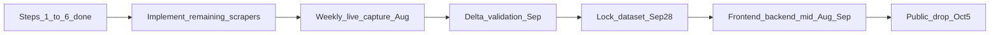

# Intelligence Report Handoff

Self-contained handoff for the next agent. Contracts and data shapes live in the architecture and design-token specs — do not duplicate them here.

---

## Mission & deadline

**Deliverable:** Digital Intelligence Annual Report — Banking Sector 2026  
**Public drop:** 2026-10-05  
**Measurement window:** 2025-10-01 → 2026-09-30 (`America/Nassau`)  
**Imprint path:** `ingestion/intelligence/` + `data/intelligence/` (JSON-on-disk only for Issue 01)  
**Cohort:** six banks in `ingestion/intelligence/cohort.yaml` (handles verified May 2026, commit `197f1c7`)

---

## Read these first

1. [intel/bod-intelligence-architecture.md](bod-intelligence-architecture.md) — build plan, module contracts, registry, methodology gates, §8 build order  
2. [intel/bod-intelligence-design-tokens.md](bod-intelligence-design-tokens.md) — `/intelligence` visual tokens (deferred until data shape locks)  
3. [ingestion/intelligence/cohort.yaml](../ingestion/intelligence/cohort.yaml) — source of truth for banks, handles, `series_token`, methodology rules  
4. [REPO_AUDIT.md](../REPO_AUDIT.md) — import style, path constants, logging, embedding reuse conventions  

---

## Out of scope / already shipped (do not reopen)

Site budget work is live on `main`. Do **not** redo unless asked:

- Maintenance off; FY 2026/27 current; FY 2025/26 also published locally  
- Fiscal-year switcher fixed (no silent API fallbacks) — commits `33c8ffd`, `da0a01e`  
- Local Docker Postgres on `5433`; publish via `backend/scripts/publish_document.py`  
- Production still needs its own re-publish of corrected 2026/27 + 2025/26 if prod DB is stale  

---

## Repo map

```
ingestion/intelligence/
  cohort.yaml, cohort.py, types.py, errors.py, logging_config.py, run_capture.py
  social/     wayback.py (real) + facebook, instagram, youtube, tiktok, twitter, socialblade (stubs)
  web/        similarweb, ahrefs_free, bing_serp, pagespeed, structured_data (stubs)
  capture/    orchestrator.py, registry.py, delta_validator.py (stub)

data/intelligence/
  raw/  processed/  exports/  logs/capture.log  registry.json

tests/intelligence/
  test_types.py  test_registry.py  test_wayback.py  fixtures/  …
```

Pydantic contracts (`Platform`, `SourceProvenance`, `SocialMetric`, `PostMetric`, `WebMetric`, `CaptureResult`) are in `types.py` — see architecture §3.

---

## Done vs not done (architecture §8)

| Step | Status |
|------|--------|
| 1 Scaffold | Done |
| 2 Cohort verification | Done (`197f1c7`) |
| 3 `types.py` + tests | Done |
| 4 `registry.py` + tests | Done |
| 5 `wayback.py` + fixtures | Done (only real scraper) |
| 6 Orchestrator + `run_capture.py` | Done — only `"wayback"` in `SCRAPERS` |
| 7 Remaining scrapers | Not started (1–2 line stubs) |
| 8 `delta_validator.py` | Stub only |
| 9 `methodology.md` | Missing |

**Runtime reality**

- `data/intelligence/registry.json` = `{"captures": []}`  
- Trial RBC processed JSONs exist under `processed/2024-05-15/` and `processed/2026-05-15/` but are not in the registry (Wayback: no snapshot in ±7 day window)  
- Design tokens drafted; no `frontend/src/app/intelligence/` or `backend/app/api/intelligence.py` yet  

---

## How to run

From repo root (`PYTHONPATH` includes repo root — `run_capture.py` inserts it):

```bash
python ingestion/intelligence/run_capture.py --date 2026-08-15 --bank rbc_bahamas --scrapers wayback
pytest tests/intelligence/ -q
```

`--bank` and `--scrapers` are repeatable; omit `--bank` for all cohort banks; omit `--scrapers` for every key in `SCRAPERS`.

---

## Next work (ordered)



1. **Implement scrapers** in order: `youtube` → `similarweb` → `instagram` → `facebook` → `tiktok` → `bing_serp` → rest (`twitter`, `socialblade`, `ahrefs_free`, `pagespeed`, `structured_data`). Each must export `async def capture(bank_id, cohort_entry, capture_date) -> CaptureResult` (architecture §2). Register each in `capture/orchestrator.py` `SCRAPERS`. Ship fixture tests under `tests/intelligence/` per module.  
2. **Wire real captures** into `registry.json` and `data/intelligence/processed/{date}/{bank_id}.json` (orchestrator already writes processed + `mark_capture`).  
3. **Wayback backfill (Aug 1–20)** for Oct 2025 – Jul 2026 follower trajectories.  
4. **Live capture:** weekly `run_capture` from Aug 1; daily on the final two weeks before Sep 13.  
5. **Implement `delta_validator.py`** + Rival IQ (Sep 14–27) / SEMrush (Sep 21–27) trial comparison; flag >5% variance.  
6. **Draft `methodology.md`** after first real data lands (grounded language).  
7. **Freeze dataset Sep 28** for Issue 01 publication.  
8. **Surface:** build `frontend/src/app/intelligence/` (design tokens via `[data-imprint="intelligence"]`) + `backend/app/api/intelligence.py` against locked shapes. **No Postgres / Alembic in Issue 01.**  
9. **Press pre-brief** Sep 28 – Oct 2; **public drop Oct 5** (report + dataset + open-source code).  

---

## Non-negotiable methodology gates

| Gate | Rule |
|------|------|
| Public only | No auth cookies, OAuth, or session storage |
| Rate limit | ≥2s between requests to the same host; backoff on 429/503 |
| User-Agent | `BahamasOpenDataBot/1.0 (+https://bahamasopendata.com/intelligence)` |
| robots.txt | Honour where present; disclose deviations in methodology.md |
| Provenance | Every metric: source URL, UTC `fetched_at`, HTTP status |
| No synthetic data | Failures → `None` / errors list — never infer or interpolate |
| No mock API | Future `/api/v1/intelligence/*` raises on missing data — never mock like `/ask` |

---

## Open decisions (unresolved)

1. **Naming:** `bod_intel_*` (public brand) vs `np_intel_*` (`national-pulse`) vs mixed — for v2 tables, logs, Pinecone `document_type`.  
2. **Series colours:** final lock of `--intel-series-1` … `--intel-series-6` to the six banks (provisional today via `cohort.yaml` `series_token`).  
3. **Bahamian number formatting:** BSD currency placement, decimal separator.  

Do not auto-resolve these — flag for human sign-off.

---

## Definition of done

- Six banks captured across required platforms for the measurement window  
- `registry.json` complete; captures reach `validation_status: "validated"` where applicable  
- `methodology.md` published and grounded in real capture behaviour  
- Report + dataset + code drop on **2026-10-05**  

---

## Do not touch

Budget maintenance, fiscal-year switcher, or FY publish pipeline (`backend/scripts/publish_document.py`, published FY 2026/27 + 2025/26 state) unless separately requested.

---

*Handoff for Banking Sector inaugural issue · sources: architecture v0.2, design tokens v0.2, cohort.yaml · KGC / Bahamas Open Data*
